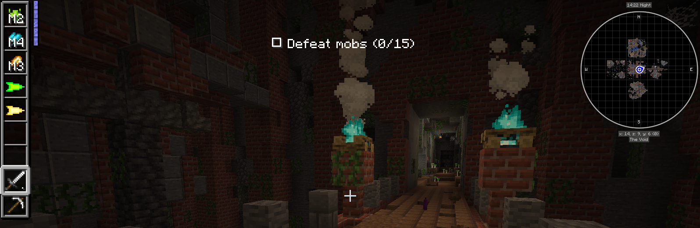

# **WotR 0.3.0 for dummies (WIP)**

Welcome Wanderers

This is a guide through Wanderers of the Rift (WotR), before you ask what is Wanderers of the Rift and how do I play it, I will answer that in this guide 

Wanderers of the Rift (WotR), is an ARPG, dungeon crawler modpack for Minecraft Java 1.21.1+, and is based around you **A Rift Wanderer**.

What is A Rift Wanderer?

A Rift Wanderer goes into Rifts to defeat enemies and loots the rift for any good items that may help them on their journey and help guilds with their quests.

How do I get started and enter one of these Rifts?

# **How To Get Started**

To get started in WotR you will need to obtain a ***Rift Key*** and a ***Rift Spawner***.

But WolfsWeb how do I, a Wanderer obtain a ***Rift Key*** and a ***Rift Spawner***?

Well that is easy Wanderer to obtain both Key and Spawner you will have to craft both:

# **Rift Spawner**

The ***Rift Spawner*** is a simple craft only two types of items need, 1 ender pearl and 8 stone please see image below for how to craft it.

# **Rift Key**
Now as for the ***Rift Key*** on the other hand you will have to craft yourself a ***Key Forge*** in order to obtain a Key.

# **Key Forge**
Is it hard to craft a ***Key Forge*** and what will I as a Wanderer need?

No it's not hard at all. All you need is a flower pot an iron block a blast furnace and any type of log, see image below for crafting Recipe.

After Crafting yourself a ***Key Forge*** you can now obtain a key by right-clicking the forge and giving it any 1-5 vanilla items that inturn will give you a level one key.

# **Rifts**
Once the Wanderer has given their items to the forge they will see once hovered upon, the key will give information. The info the Key will give is the following: 
*Tier*, *Theme*, *Objectives*. (Try giving the forge different items for different themes).

Now with Key in hand the Wanderer can go up to their ***Rift Spawner*** and right-click the Key onto the Spawner to open the Rift.

Once inside the rift the Wanderer will have the objective shown to them on-the top of the screen and are now free to travel through the different rooms in the rift looting and killing Rift enemies.

## **Themes**
How many themes are there for the rift?

There are currently # Number of themes avalible and more to come.

What items give me what themes?

Item gives = #Theme

Themes determine the mobs, loot and what the actual rifts look & feel.

### Objective

The Objective of each rift at the current time is the following: 
- Kill Mobs
- Close Anomalies
- Objective Blocks
- Stealth

Where will I find the objective?
- The Objective will be shown at the top of your screen 

# Kill Mobs:
How many Mobs would a Wanderer like me have to kill?
- Anywhere between # - #

Where do these mobs come from?
The mobs in the rifts come from spawners located in each room of the rift and each one of these spawners have chests that spawn under and around said spawner.
(Please note that the spawners and chests - aka POI's are found throughout all our rifts) 

How many spawners are located in one room?
- Depends on the room and the type of theme of the  rift and who build the room, some can have 5 where other could have 8 but on average about #

# Close Anomalies
How many Anomalies would a Wanderer like me have to close?
- Anywhere between # - #

Are these Anomalies in every room?
- No they are not in every room but spread out throughout the whole rift.

# Objective Block
What is an Objective Block?
- An objective block is what it sounds like it a block that u have to find in the rift.

What Does this block look like?
- The objective block currently is a red glowing block and it spawns in almost every room?

(Image to go here)

What do I as a Wanderer have to do with these objective blocks?
- That is simple all you need to do is right click on one of these blocks that it will add the count to your objective

How many of these Objective blocks would a Wanderer such as myself have to click on?
- Anywhere between # - #

### Tier
How many Tiers are there?
- As of 0.3.0 there are # tiers

How do I obtain the higher Tiers of the Rift ***Keys***?
- By giving the Key bench more items will determine the tier of rift key you get 

Why would I want a higher tier of Rift?
- Higher tier Rifts give better loot
- Better quality Items
- Better quality Gear

### Loot
Speaking of loot this is what you can expect to find:
- All essences that are needed to craft new Rift ***Keys***
- Armour
- Tools
- Abilities
- Raw Geodes (Used to get gems for gear)
- Skill Thread (Used to upgrade Abilities)
- Other Random items

### Abilities 
Here is a list of all abilities & what they look like:
- Heal
(image of heal)
- Fire Ball
(Image of fire ball)
- Dash
(Image of Dash)
- Poison Dart
(Image of PD)
- Dirt Dart
(Image of DD)
- Ice Dart
- Veinminer
- Life Steal
- Earth Breath
- Fire Breath
- Ice Breath
- icicles
- Levitate
- Knockback
- Lightning Breath
- Lightning Dart
- Mana Cat
- Mega boots
- Painful Sneak
- Poison Breath
- Pull
- Slime Wall
- Squawk Strike
- Stab-Stab-Slash
- Summon Skeletons
- Teleport
- Strength Chain

How Do I Equip these Abilities?
You can equip each ability and upgrade them in the ***Ability Bench***, which is quite easy to make as
seen in image below.

Ability Bench Recipe:
(Image of Ability bench Recipe)

How do I upgrade my Abilities?
(Image Of Ability Bench UI)

As seen in the image above there is a solt for the skill on the left and on the right is where you will find
a slot for Skill thread.

Once the Ability is in the slot on the left a list will appear just under the skill thread slot:

(Image of an item in the ability bench)

### Geodes
Geodes are