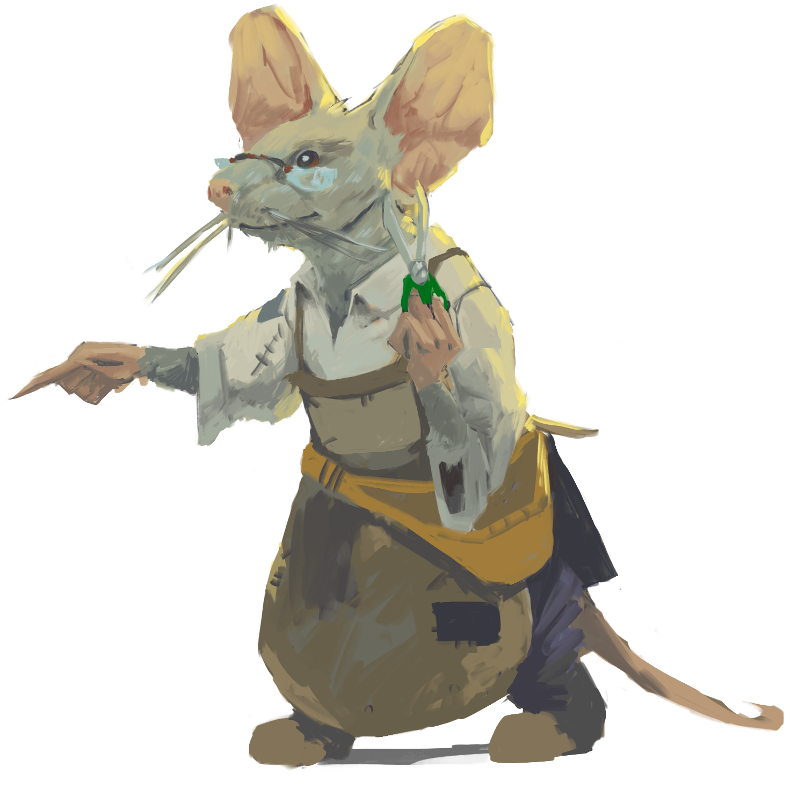
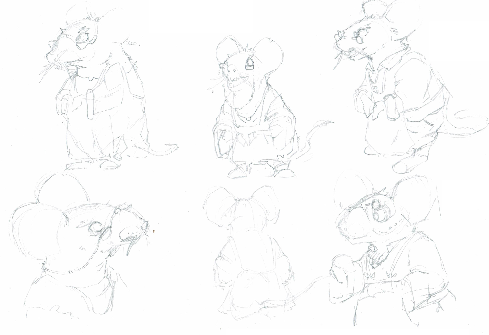
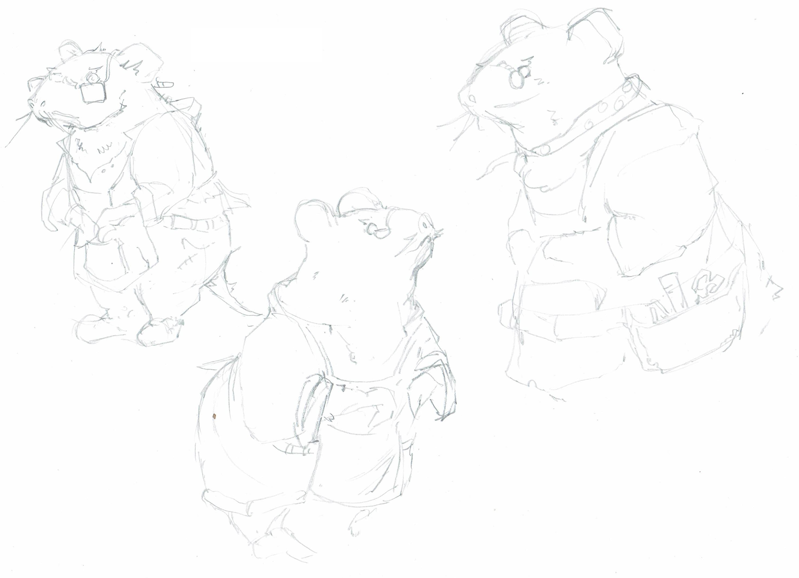

# Threadwright Atelier (Ability Guild)

[**Concept Art**](#concept-art) • [**Story**](#story) • [**Concept**](#concept) • [**TLDR**](#tldr)

---

## Concept Art

 

 

---

## Story

When wanderers began returning with strange essences and impossible materials most focused on what they could build or craft with these new substances. But a small community of mice already renowned for their delicate needlework and patient craftsmanship noticed something others missed entirely.  
The essences carried more than just raw material: they held echoes of capability itself. Potential resonated with the inner nature of those who handled it. While others saw building blocks the mice saw threads of possibility waiting to be woven.

Led by **Thimbleclaw**, these artisans established their workshop. They discovered that through careful processing the dimensional essences could be spun into threads that could then be woven into a person's existing being. This influenced their abilities, strengthened and refined those natural talents in remarkable ways.

The mice understood that true power comes not from acquiring new abilities but from perfecting what already exists within you. Every person carries unique patterns of potential. Some call this potential their "grain" like wood while others refer to it as their “weave." The Threadwrights can read these patterns and select exactly the right threads to enhance them.

They never claimed to teach new skills or grant magical powers. They offer something far more valuable: the patient and meticulous work of helping individuals become the fullest expression of who they already were.

Their textile mill stands as testament to this gentle philosophy. The sound of ancient looms echoes through weathered halls as colorful threads dance through brass guides. Every strand carrying the potential for someone to discover just how remarkable their own natural abilities can become.

This guild remains humble about their role. Acting as **'simply tailors'** and helping people wear their talents with greater grace and strength. Once you have experienced their work you will know the truth: there is profound magic in becoming exactly who you were all along.

Through careful threading, patient guidance and wisdom the mice continue their modest tasks one perfectly fitted ability at a time.

---

## Concept

### Core Concept
An **ability enhancement and progression guild**. They introduce the ability system further building on what already exists in the MVP.

---

### Skill Threads
Unlike traditional skill trees or class systems, we already have skills that are leveled with skill thread separately from player level and allow the player to augment these skills each skill level. The Threadwright Atelier expands on this system in a way that works with each player's natural gameplay preferences.

---

### Core Philosophy
- Abilities leveled and augmented/refined  
- Every player can augment based on their unique playstyle  
- Enhancement comes through selection of skill thread material(s)  
- Results vary by individual, creating personalized progression  

---

### Material Framework*

Eight distinct thread types looted from rifts create enhancement possibilities:

- **Warp Thread (White):** Foundation reinforcement  
- **Weft Thread (Gray):** Support structures  
- **Brocade Thread (Gold):** Ornate enhancements  
- **Jacquard Thread (Purple):** Complex modifications  
- **Twill Thread (Blue):** Diagonal strengthening  
- **Canvas Thread (Brown):** Heavy structural support  
- **Damask Thread (Silver):** Reversible effects  
- **Chenille Thread (Green):** Adaptive enhancements  

* All names/purposes are arbitrary and used as examples/placeholders to fill out the concept.

---

### Progression Structure
- **Hard Cap:** Player level determines maximum ability level  
- **Soft Cap:** Guild progression unlocks enhancement options  
- **Investment System:** Currency + specific threads (to target specific augments) + player choice  
- **Customization:** Multiple modification paths per ability type  

Creates meaningful choices while respecting individual player preferences and natural gameplay tendencies.

---

### Player Engagement Cycle
- **Discovery:** Understanding your ability augments/refinement options
- **Collection:** Gathering appropriate threads through rift looting
- **Enhancement:** Making meaningful upgrade choices
- **Mastery:** Refining abilities toward personal perfection
---

### Benefits
- Supports diverse playstyles without forcing specific builds or approaches
- Enhances rather than overwrites existing mechanics
- Can scale with WotR development and player advancement

---

### Discovery & Narrative
Players encounter a mouse artisan working alone in a nearly depleted textile mill. Using their final precious thread, they demonstrate ability enhancement on the player, creating both mechanical tutorial and emotional investment through sacrifice.

---

### Themes
- **Humble Mastery:** Guild members are "simply tailors" helping people "wear their talents with greater grace"  
- **Patient Craftsmanship:** Reinforces thoughtful progression over instant gratification  
- **Personal Discovery:** Enhancement reveals and strengthens what already exists within each player  

---

### Visual Design
A weathered textile mill complex featuring:
- Oak timber frames with rusted iron accents  
- Vintage industrial lighting illuminating custom dark hardwood looms  
- Workshop stalls with rich mahogany paneling and leather furnishings  
- Brass conduit systems carrying colorful threads between areas  
- Antique display cases showcasing thread samples and techniques  

---

## TL;DR
- **Threadwright Atelier** is an ability enhancement guild that expands existing skill thread system.  
- Uses **skill threads** looted from rifts to refine player abilities based on personal playstyle.  
- The guild is themed around humble mouse artisans led by **Thimbleclaw**, operating a vintage textile mill.  
- Players engage in a cycle of **discovering, collecting, enhancing, and mastering** their own unique talents.  
- Provides meaningful progression that emphasizes becoming the best version of oneself, rather than learning new arbitrary skills.

---
