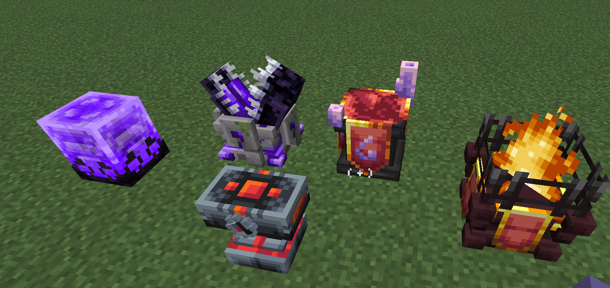
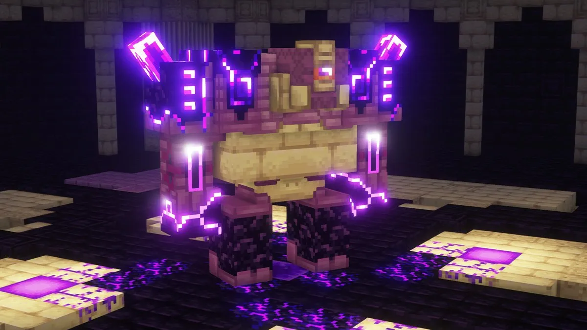
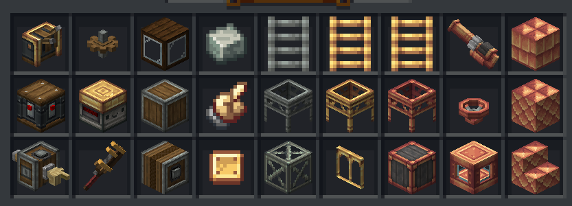
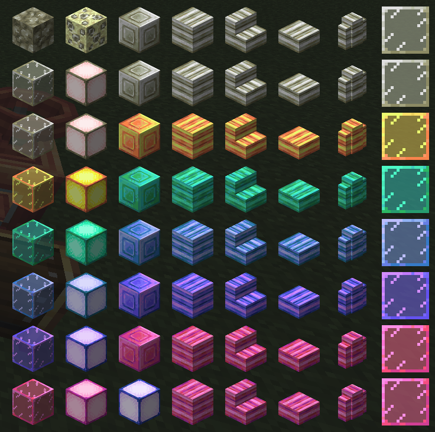
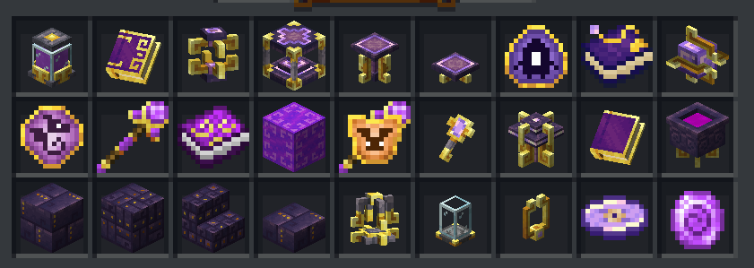
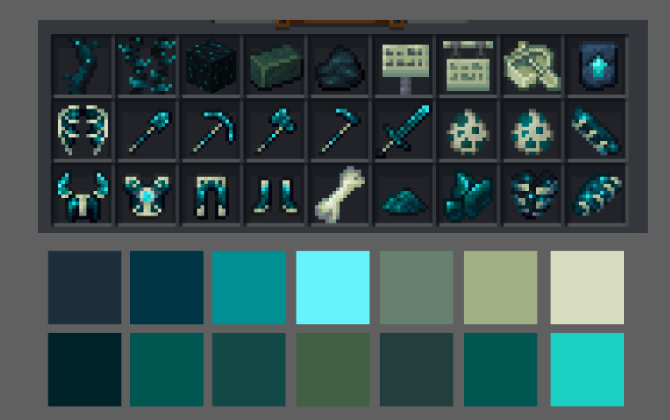
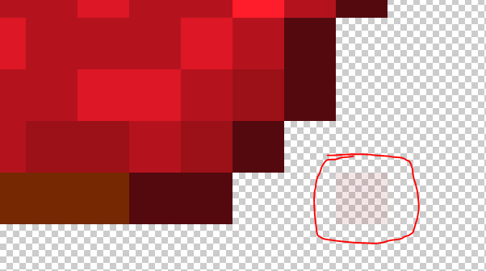
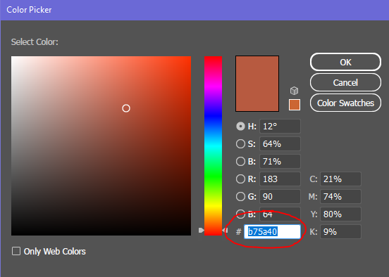
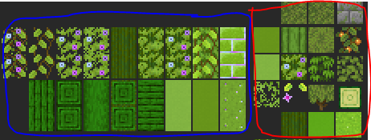

This guideline will more than likely grow a lot as we make more progress. After an internal overview and discussions, we have gathered quite a few things to help us give everyone a bit more of some art direction and guidelines to help us move art a bit forward.

# Guidelines
#### 16 x 16 pixel ratio for all the artwork
#### Stay within the realm of Minecraft style
#### Icons/sprites have a darkened border around them

We should try to always keep this style aspect because it's what makes items look like they are in a Minecraft style. The amount of how dark a border is can be subjective, but I would refrain from using pure black.
Many may not realize but even the darker border follows shading/lighting where the bottom sides are often darker to give a shadow effect.

And it can be subtle or even a bit more contrasting.
A Minecraft item slot in almost all GUI containers like the inventory are all 16x160

As much as humanly possible we should strive to always keep a 1px space between items and the border of the 16x16 box

Sometimes this is not always possible, but we should try to keep it this way as much as we possibly can. Here is an example of how it sometimes does not:

It's okay if small parts sometimes touch the edges, just try to refrain from having things touch edges as much as possible.
(This only applies to items that will be in inventory - this does not apply to icons like abilities)
#### Icons should be fairly simplified, but this does not mean that they should be flat or boring
This means that you should really try to simplify your drawing/idea as much as you can while still being able to convey what it is clearly to the audience.
If you make very over-complicated icons, the details can get lost or blend together when small - making it hard or impossible for viewers to understand what the item is.

# 3D Objects, Workbenches, Etc.
#### Keep 3D builds as simple as possible and let the texture do most of the heavy lifting
#### Do not use too many shapes/voxels for "details" when those details could be achieved with the texture

#### 3D and block textures should also follow the 16x16 pixel ratio rule
#### Most small objects like teeth and other details are usually flat and not full small voxels

#### Always make sure that the tiling of a block makes sense and doesn't create weird shapes or has a disconnected tiling effect
You typically want to be creating seamless tiles in most cases
Of course there are exceptions - and they are for a good reason.

Like with things such as a diamond, gold, iron blocks, and even blocks like the sealantern as well
# Art Style Direction
After much discussion we have found some example of art and art style references that really give off the quality and standard of work we are really hoping for when it comes to creating art for this project. Of course we all want this project to look amazing so we have something we can be proud of and people really enjoy. To do this we really need to focus on creating quality content. Here are some examples of other works that we feel really helps convey that level of quality we hope for.

Clean and beautiful workbenches, they don't need to always be something like 2 blocks wide like this example, but these are a very good references for building other types of workstations and give good examples of how to follow the 16x16 pixel ratio as well as keeping things fairly simple and letting the texture do a lot of heavy lifting in most cases.
It also helps give a good reference on how to keep things within an understandable size reference. The size of things next to other items, and how big things should be in contrast to other items.
These 3D references from Cataclysm Mod are also very nice

	
	
	
	
	

The Cataclysm Mod also shows great examples of how to keep blocks, items and workbenches within a "theme" they have two separate themes here as an example between Nether themed and End themed

Here are some nice-looking item references also seen from the Occultism Mod

	
	

When it comes to other blocks and 3D creations, it's really great to look at the Create Mod

	
	

3D materials, workbenches, and blocks in Create also are a great example of keeping things simple and letting the texture do a lot of heavy lifting

Create is also a great example of how to follow color schemes and color pallets when creating variations and items that combine main materials like the metals in this example
You want to follow the color schemes of specific themes and keep it very close to the actual colors used to keep consistency and make it understandable that these things are related somehow, and we do that by keeping the color schemes consistent visually
Create also often incorporates many default minecraft textures as well - making it so their items also match with vanilla minecraft blocks like the spruce and dark oak wood. This is really nice to do sometimes and can help tie blocks into other minecraft blocks for people who love to build and need blocks that match but have variations

Here is a great example of keeping a color scheme across materials and items from the Enlightened Mod

The nuggets, ingots, blocks, weapons and armor all follow a very set color theme and execute it well
This mod is also further a wonderful example of following color schemes

When it comes to blocks, block-states and other building items and blocks
Blocks and items that follow a theme should stay very consistent when creating other variations to match with that theme

So when we create our color schemes and palettes we should strive to follow it as best we can
Other great examples and references for keeping with a specific style and color scheme is something like this from Ars Nouveau mod

	
	

This is another example similar to the Create Mod how you can keep 3D objects, blocks, items, and other things within a very tidy and clean color scheme/theme
These all have a very specific Purple + Gold color scheme and all the objects follow the same style theme with the square-ish swirled corners and details
Always using the gold as this structural metal accent and the purple always being this other more stone-like material
Its a great way to keep a visual consistency - keeping some of the details on the objects similar in color and style to create a style consistency

#### Some items may break some rules
like the dark outlines rules and those things are usually items like flowers

Flowers and plants in Minecraft often break the rules of "dark outlines" and also the 1px space in the 16x16 frame
Not many other items break these rules, it's very few and far between.

This is because of how the image is used to make the actual "3D" plant/flower
Where the image is usually criss-cross in an X formation like this

	
	

Here is more references to items that follow a color scheme/theme wonderfully from the Deeper and Darker mod

These items are also well made and another example of how to follow the rules of the darker borders + 1px space

Creating a color palette of blues and greens with this cream/bone-like color as secondary color and the bright cyan as an accent color
So when we have a theme that has a color palette like this:

We want to follow it - and execute it - in a very similar fashion/way

# Exporting Items
The best way to export items is to make sure you export the item inside and with the artboard size. 16 pixels x 16 pixels

Items should be exported with a transparent background as a .png

 Opacity on items doesn't work the way you want it to
You cannot have semi-see-through colors with a low opacity on items
that low-opacity spot will render full opacity
This is why its really important to clean up your icons from any stray very very low opacity pixels - they will show up when rendered
Especially in the areas you want to be transparent

you care barely see it here, but this stray very low opacity pixel WILL show up in full solid opacity when its loaded in the game

# Color Schemes
I would say its best to look for color combinations that work really well together and offer something possibly unique or help match other existing blocks or vanilla blocks

This website can help you pick colors and their different complimentary colors like color Triads, Tetrads, and Adjacent colors
You can also find other generators like these online as well
https://www.canva.com/colors/color-palettes/
Canva also has a library of nice color palletes

But there are also a lot more websites online that offer color palettes as well one that I love to use often is https://www.colourlovers.com/
when creating a color palette is is best to also include the colors Hex codes as well

	
	

But we should always keep in mind to pick color schemes that actually _work_ well within our project and compare them next to other items and blocks that we have
Sometimes it's wonderful to create some colors or color variations that our pack or minecraft does not offer as well
But overall you need to be sure that it still "works" with other blocks and can be used (for the most part)
Here is an example of that from my artboard where I was working on blocks for the Vault God - themed blocks

The blue section are the new blocks and the red section are the minecraft colors and blocks there as a reference
But you can see that darker green wood that doesn't exist in minecraft or that pack
It was something new, but it still worked well with the color scheme and provided a new block and color for builders to work with
I'll show also another exampe from another artboard where I made many new block colors

Here are some examples of really great food items to use as a reference when making food or crop items

This example is from the Croptopia Mod

Notice how they are so simple but really get the main idea across?

# Checking Items Against Minecraft Grey
It's really important to check if your art assets work well against minecraft grey like in the inventory and hotbars

You might make an item that looks really cool but once you test it against the background of minecraft grey parts of it could vanish or not have enough contrast to stand out correctly in the inventory
It's best to work with that grey as your "paper color" or "background color" while working to help you see if your art has enough contrast against minecraft grey
**Minecraft grey hex code is around:** #8b8b8b

# Creating Minecraft MCmeta Animations
Minecraft animation on most items and block textures are done using MCmeta files and the code that tells minecraft how to run the animation.
the picture files are made creating a long strip of 16x16 frames

So your height of your document will also be in multiples of 16
Minecraft frames ALWAYS start with Zero 0 as the number for the first frame

The frame strip is saved as a .png as normal

But there is also a basic notepad document that goes with it
That is the MCmeta file that contains the information on how the animation should go
And the name of the file always contains the FULL name of the image it's connected to
Here you can see the PNG's name is "chromatic_steel_ingot.png"
And the MC Meta file's name is "chromatic_steel_ingot.png.mcmeta"

This is an example of the MCmeta code
It's pretty simple
As you can see it is telling minecraft that this animation takes the frames in this order 0,1,2,3,4,5,6,7,6,5,4,3,2,1
So it basically... goes down the strip, and then goes back up the strip

You don't have to write the zero 0 at the end because the process will start again at zero 0 (so adding it to the end is a bit redundant)
The "Frametime" is just how fast the frames go/how many ticks
And the "Interpolation" is if you want the frames to gradually fade from one to the next or not
Here it is set to "True" which means that the frames do gradually fade from one to the next
Setting it to "False" would make them blink quickly between each frame very sharply
This can be helpful when you are making something like a blinking light on a something electrical
Your MCmeta file needs to follow this code layout to work correctly

 A COMMON MISTAKE
People make is that at the end of the frame list they accidently add a comma ( , ) at the end of their frame list and this will mess up your animation from working.

the last frame in the list does not need a comma, if you add one it will not work
There are other cool things to do with animation and MCmeta code, you can find those online with a quick google search
And this is an example of how it works, and what it means, but there are many ways to write the frames to give awesome effects

# Design Inspo Based On Recipes
So, I was talking about this earlier in another thread and its a good thing to also mention here as well
Lets say you are making a new 3D design or an item, somethin that can be helpful when making an item is to look at the items in the recipe that create it (if applicable)

Taking this anvil as an example - from the Cataclysm mod
It has these reds and oranges and greys in its texture design
which is influenced on its recipe components

The red from the redstone blocks, and the orange and red "veins" on the ingots
This is another way to create things in a way/fashion that helps keep within a theme as well