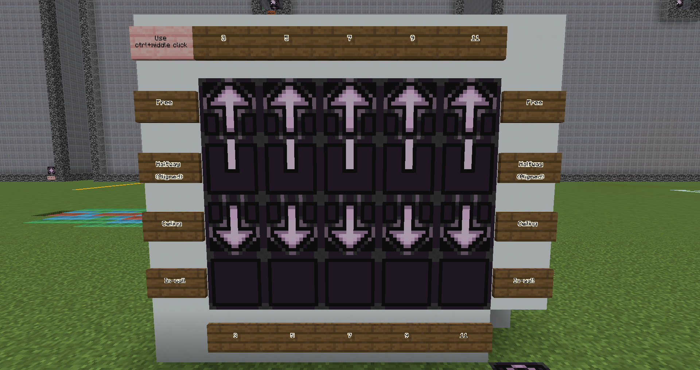
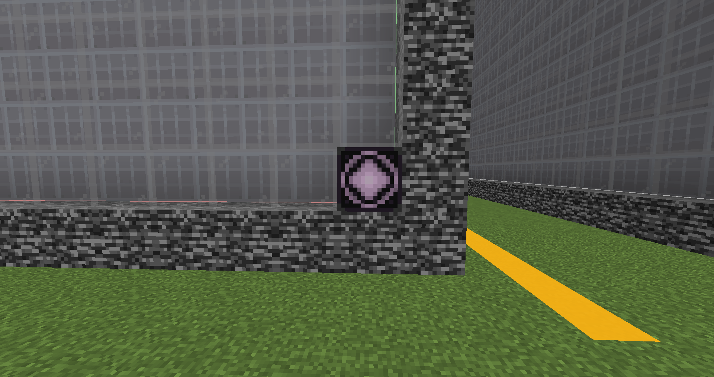

# Build Tutorial
_(Work In Progress, also some things are not yet implemented)_
## Table of Contents
 - [Chapter 1: Setting up](#chapter-1-setting-up)
 - [Chapter 2: Introduction to building](#chapter-2-introduction-to-building)
 - [Chapter 3: Building and rules](#chapter-3-building-and-rules)
 - [Chapter 4: Making processors](#chapter-4-making-processors)
 - [Chapter 5: Questions? Ask for help!](#chapter-5-questions-ask-for-help)
 - [Appendix A](#appendix-a)

## Chapter 1: Setting up
To get started with building for WotR, first you need to download [Prims modloader](https://prismlauncher.org/download/windows/), and the builders [modpack](https://discord.com/channels/1328761294085554176/1336719831537553469/1352027237821710509).
After setting up Prism, click on "Add Instance", "Import", "Browse" and locate the Builders Modpack you've just downloaded.

Another great tool to download is the [resource pack](https://discord.com/channels/1328761294085554176/1336719831537553469/1352674512340258966), which is used to indicate the status of your builds. Launch the Builders Mod, go to "Options", "Resource Packs", "Open Pack Folder" and place the resource pack .zip in here.
Make sure you enable it by pressing the arrow on the icon.

Before you can get on the Builders Server, put your minecraft name in the [Build Server Whitelist channel](https://discord.com/channels/1328761294085554176/1336719831537553469), but offline building is also possible.
The last thing you need to do, is putting your Discord name and timezone in the [Builders Sheet](https://discord.com/channels/1328761294085554176/1335631637769097236/1341132646612336773), and pick an unused signature. This sheet will be used throughout the tutorial.

## Chapter 2: Introduction to building
Before we can get started with building, we first need to cover the basics. It is also advised to follow a tutorial on the basics of both WorldEdit and Structure Blocks, but not required.

### Rooms and POIs
Rooms are the main structures the game is played in. This is what you travel through in a rift.  
POIs are the small structures inside rooms that contain loot and enemies.  
Those two are the main structures of the game, and will be randomly generated every time you open a rift.
There are several sizes for both of them. For POIs, which have a footprint of a square, we indicate that by the horizontal length. 
The lenghts used are: 3,5,7,9, and 11.
For Rooms we do not use the length of a block to indicate size, but a multiple of 15 (and a bit), the details can be found in the Docs. 
A (3x3x3) Room is 47 blocks long in X, Y and Z direction, respectively.

There are different varieties for both of them, lets start with Rooms:
 - Stable Rooms: Always 3x3x3, and well-reachable doors. You don't need to build or break, nor travel long distances, to reach all exits.
These rooms are the first encountered when opening a Rift.
 - Unstable Rooms: 3xYx3 Rooms, they have varying height. The doors are not always well-reachable, and they are found around Stable rooms.
 - Chaos Rooms: Varying sizes, between 1 and 3. Those rooms do not have doors in the center of the faces, but on multiple fixed possible places. 
They are placed on the outside of the Rift.

There are also varieties of POIs:
 - Free: Free standing POIs can be placed all over the floor.
 - In-Wall: POIs that fully carve into the wall, like a cave.
 - Halfway: POIs that are half insid- and half outside (rounded up) the wall. 
 - Ceiling: Those POIs are placed on the ceiling of the rooms, like a chandelier.

### Structure blocks and Jigsaw blocks
The created structures are saved using structure blocks. If you use the templates, those are provided. Do not forget to use them to save, however.
Jigsaw blocks are the blocks that make generation of Rooms and POIs possible. They are pre-configured too.

### Processor blocks
Processor blocks are the blocks we (mostly) use to create rooms and POIs. They will be themed with a processor every time they are generated in game. For example, 
a processor block in a cave theme will turn into stone, but the same block in a forest theme will turn into wood. An example is shown below.
`image missing`

### Guides in game
At the spawn location of the build server, a few guides are placed that give examples of the things above, and empty templates
are provided. On singleplayer, you can use the command: `command here` to spawn in the guideline pieces.

## Chapter 3: Building and rules
To get consistent and quality rooms, there are a few rules we agreed upon:
 - Naming: The created room has to be saved using the following structure:
   `wotr:rift/room/stability/XYZ/main_feature-#-signature`.
   Where Stability is Stable, Unstable or Chaos, XYZ is the size in every direction (1, 2 or 3), and mainfeature is the main feature of the room, chosen by the builder, # is the variation number, signature is the builders signature.
   Example: wotr:rift/room/stable/333/testRoom_1_builderName.  
The created POI has to be saved as the following: `wotr:rift/poi/type/size/main_feature-#-signature`.  
Here, type is free, inwall, halfway or ceiling. Size is one of 3, 5, 7, 9 or 11.
 - Room surfaces: The surfaces of the Rooms need to be at least 3 blocks thick. This is to prevent a casual player to accidentally
dig into bedrock. This is not a hard rule, but around 90% of the surfaces need to have this thickness. The exception for this are (1xYx1) Chaos rooms, as they are too small otherwise, and may use 2 blocks thick surfaces.
 - POI chests and spawner: Every POI needs at least an amount of chests equal to its length, and 1 trial spawner. 
 - When making a Chaos room, at least 1/3 of the doors must remain open. To close other doors, remove the jigsaw blocks. Do not 
fill the doorway with bedrock, this will be generated automatically.

### Spawning template
On the build server, a template for every structure is provided, and placed in an appropriate location. To make locating this easy, Stable room templates are light gray, Unstable room templates
are pink, and Chaos room templates are red. If there are no empty templates for the structure you want to build, please contact a
build coordinator. 

In a singleplayer world, you can use the command `Command here` to spawn in the template of the structure you want to build.

### Using fixed processor blocks
There are fixed and custom processor blocks. Fixed processor blocks are always used for the same purpose, a wall processor block should always be used for walls.
Numbers 1-8 are fixed, see table below for their use. Use these when making builds, both rooms and POIs, so the processors can easily target them. 
A theme will always make sure that those blocks will be turned into thematic blocks. 

| Color  | ID   | Name                | Use        |
|--------|------|---------------------|------------|
| Grey   | 1    | `processor_block_1` | Walls      |
| Orange | 2    | `processor_block_2` | Paths      |
| Green  | 3    | `processor_block_3` | Floors     |
| Purple | 4    | `processor_block_4` | Alt Wall   |
| Blue   | 5    | `processor_block_5` | Dark Floor |
| Yellow | 6    | `processor_block_6` | Planks     |
| Black  | 7    | `processor_block_7` | Bricks     |
| L_Blue | 8    | `processor_block_8` | Alt Path   | 

Where walls, paths and floors comprise the bulk of the room.

Alt wall can be used for etching, and indicators like cracks. Dark floor can be used in corners, further away from the path. Planks will (almost) always be planks, for things like bridges. Bricks can be used to indicate a more solid part.
The alt path can be used to surround the path, to make it blend in a bit more.
Water can be used as the themed liquid. If you want themed leaves, use 'processor_block_6_glass', which will often be turned into leaves. If you always want leaves, use a custom processor block family.

The specific blocks have a suffix like: `processor_block_1_slab`.
Every family of processor blocks contains:
 - Full block
 - Pillar
 - Slab
 - Stairs
 - Wall
 - Button
 - Pressure plate
 - Fence
 - Fence gate
 - Pane
 - Glass
 - Trapdoor

### Using custom processor blocks
You can also use custom processor blocks, if you want a block that does not fit in any of the fixed categories, or if you want a block 
to always be from the same set. 
Examples are: glass or wood. A glass block does not belong to Wall or Floor, but having the color randomly be generated is nice, so you can use a custom processor block for this. 
When you are creating a tree, you always want this to be made out of wood, regardless of theme, so use a custom processor block for this too.
The reason those are not fixed processor blocks, is that only a small amount of structures will use them, and now the processor block number can be used for other things, with other structures.

If you use custom processor blocks, you must provide the processor yourself. This will be explained in a later Chapter.  
The full set of processor blocks is shown below, where the first 8 are fixed families, and the last 7 are custom.

### Lighting
_Poll is up for this_

### POIs in Rooms 
When building a room, you need to include POIs. This can be done by adding Jigsaw Blocks. A POI will be generated against the Jigsaw, so it must be placed a bit further. This means that for a free standing poi, the Jigsaw must be placed 2 blocks deep in the floor. The same applies to halfway POIs, but for those you must also have the small line on the Jigsaw block towards you, and away from the wall. It should also be placed against the wall. The ceiling Jigsaw must be placed 2 layers in the ceiling. For the in-wall Jigsaw, however, placement is different. Those must be placed against the wall, with the face towards the wall. This is because when it generates, it generates towards the wall, and thus be placed inside. A placement example is on the server, or can be loaded with `wotr:guides/jigsaw_placement`.

Load `wotr:guides/jigsaw_palette` to get the correct settings for all Jigsaw blocks. You can control middle-click the one you want, and place it on the correct location. They are named, so they are distinguishable in your inventory. Keep in mind how far the POI you place will reach in every dimension, they will destroy blocks when necessary! In-wall POIs do carve deep, and free standing go up high.

### Server Build Indicators
On the server, wool blocks are used to indicate the status of your Room, and the sizes of the POIs. If you've installed the resource pack, they have replaced the wool textures. POI size indicators have a number on them. The status blocks indicate:
 - Red: Still building.
 - Yellow: Would like feedback for finishing touches.
 - Lime: Finished, ready for review.
 - Blue: Want help with placing POIs.
 - Cyan: The POIs are placed by builder.

To set your structure as finished, you have to add the name on the Builders sheet. Only then it can be put in the mod.

### Saving
To save your created structure, locate the structure block for saving. For rooms, they are the inner structure block. For 
POIs, they are the top structure block. Make sure you use the correct naming convention, as written in rules. To save, press the right "SAVE" button.

To allow the mod to use your structure, copy-paste the structure name into the Builders Sheet in the correct location (Room and POI 
tabs). Ask in chat for a review.

## Chapter 4: Making processors
To start with processor generation, download the following zip file:
`json_generator.zip` from [here](https://discord.com/channels/1328761294085554176/1335631637769097236/1357334905922523236).
It uses [Python 3](https://www.python.org/downloads/).
It is also useful to open Jade plugin setting in-game (num 0 by default), scroll down to the very bottom and enable both "Registry Name" and "Block States".
This makes you able to see the names of the blocks you want to use, and their properties.  
In the sheets, only the **yellow** cells should be filled in, but not all yellow cells need to be completed.

### Custom processors
To create a custom processor for 1 processor block, use `processor_single_sheet.xlsx`. If you want to use a custom processor for multiple processor blocks, use
`processor_multiple_sheet.xlsx` instead. You only need to fill in the yellow cells of the blocks you've used, but make sure it is for the right number processor block.
State is the block the processor block turns into, for example `minecraft:stone`, and step is the portion that will get this state. It is not equal to percentage,
as it scales exponentially down. A step size of 25 for block A and 75 for block B will give a 50/50 distribution when generated. The random noise used is simplex,
it will generate smooth, organic-looking patterns with continuous gradients, like layered spheres. The sum of the steps need to equal 1, anything higher will not get
used, and lower means some of the processor blocks will not get transformed.
Checksum will turn green if the total is 1, as indicator.

A processor will generate a number between 0 and 1, and will look what block it wants to replace.
Then, it will stack the steps from left to right, adding the numbers, and look for the block that belongs to this number.
Let's say it wants to replace `processor_block_10`, and generates number `0.7`. Now if, for example, in the spreadsheet you
have `minecraft:stone   0.6` and `minecraft:dirt   0.4`, it will replace `processor_block_10` into `minecraft_dirt`. If, instead,
the number generated was `0.3`, the block turns into `minecraft_stone`. So, every block is like another layer in an onion, with the step sizes
being the thickness of the layer, and the left-most step being the outer layer.

When you're done filling in the rows of the blocks you have used, save the sheet as:
`processor_single_sheet.csv` or `processor_multiple_sheet.csv`, respectively. Place this file in the same folder as the belonging python script
(`single_json_generator.py` or `multiple_json_generator.py`). Run this, and enter the type of structure you want this processor for, either Room or POI.
Do not change the output name, please.

The last thing to do, is filling in the name of your custom processor into the Builders sheet, and give the json file to a Build Coordinator.
When approved, they will put it into the mod, together with your structure.

### Making a theme
Before making a theme, please inform the Build Coordinator, to make sure it can get used and no double themes are made. To start making a theme, use the `processor_theme_sheet.xlsx` sheet.
Theme making is similar to custom processor making, but require a state for every processor block. This is because builders can use every fixed processor block, with the knowledge it
will be processed when generated. The checksum column should be fully green.
Save this as `processor_theme_sheet.csv`, and run the python script. Enter Room or POI (often you want both, so run twice), and pick the custom choices in the popup. For POIs this is
only a chest for now, so press "OK", and you're done. For rooms, more options are available. At the top, there are a few toggle options, for if you want mushrooms or not,
for example. Below that, under the "Attachments" section, there are more customizable options. A list of example attachments is below in Appendix A. This can
generate lanterns on the ceiling, rails on the floor, or bee nests on the walls, for example, but more are possible. "Name" is the name of the block you want to attach,
"Rarity" is how often it occurs (between 0 and 1), "Up" is if it requires to touch the ceiling, "Down" is for when it requires to touch a floor, "Sides" is for how many walls it has to
be up against, "Property" is a block property you can give it, and "Value" is the value of that property. Try different rarities and properties to find whatever suits your theme.
Using Jade in-game with the advanced settings enabled, you can find the properties in the box. It is currently not possible to adjust the "facing" property to the wall it touches, so
torches against the wall do not stick out of the wall, but are rotated.

## Chapter 5: Questions? Ask for help!
If there is anything that is not clear, or would like to know a bit more about, do not hesitate to ask questions in the [build chat](https://discord.com/channels/1328761294085554176/1335631637769097236)!
There are enough members willing
to help you out. It is also very possible that more info needs to be given in this tutorial, so don't hold back.  
AND SAVE YOUR STRUCTURES!

## Appendix A
| Description            | Name                        | Rarity | Up | Down | Sides | Property 1         | Value 1  | Property 2  | Value 2 |
|------------------------|-----------------------------|--------|---|------|-------|--------------------|----------|-------------|---------|
| Lantern on ceiling     | minecraft:lantern           | 0.01   | V |      |      | hanging            | true     |        |      |
| Rails on the floor     | minecraft:rail              | 0.02   |   | V    |     |          |  |     |    |
| Bee nests on walls     | minecraft:bee_nest          | 0.01   |   |      | 1     | honey_level        | 5        |         |    |
| Stalactites            | minecraft:pointed_dripstone | 0.02   | V |      |       | vertical_direction | down     |         |    |
| Stalagmites            | minecraft:pointed_dripstone | 0.02   |   | V    |       | vertical_direction | up       |         |    |
| Cobweb in corners      | minecraft:cobweb            | 0.05   | V |      | 1     |                    |          |         |    |
| Glowberries on ceiling | minecraft:cave_vines        | 0.01   | V |      |      | berries            | true     |         |    |
| Waterlogged chain      | minecraft:chain             | 0.05   |  | V    |      | axis               | y        | waterlogged | true    |
| Random floating slime  | minecraft:slime_block       | 0.05   |   |      |      |                    |          |         |    |

