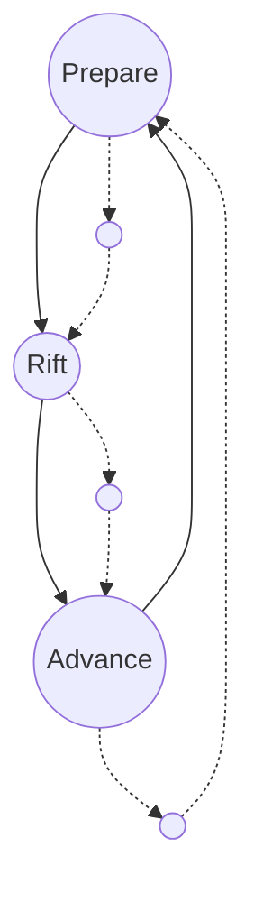
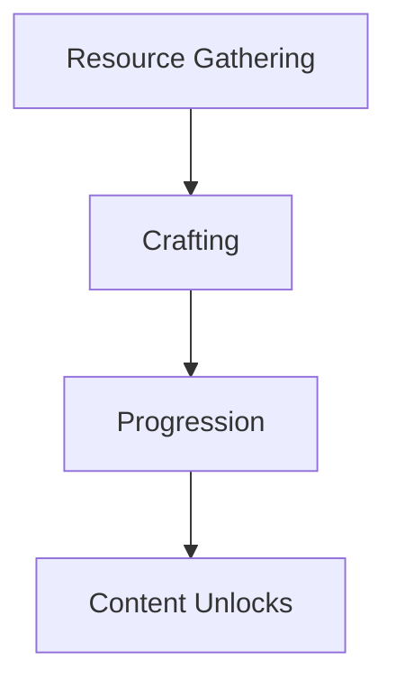

# Game Design Document
Version 0.3.0

This is the living design document for the Wanderers of the Rift.
It captures the defining principles, player experience, core and meta loops, systems, and content structure of the game.
Sections may expand and evolve over time, but this document always represents the current state of design.

---

## Pillars
Pillars are the foundation of design.
They define what the game *is at its core*.
Every system, feature, and piece of content should reinforce at least one pillar.
They are the design "spine" that prevent the project from drifting away from its intent.

### Shape your own Path
Design open ended systems where choices matter. Avoid fixed roles or narrow solutions.
Support multiple valid play-styles so players decide how they play, what they pursue, and what mastery means to them.

### Meaningful Progression
Growth is earned, impactful, and exciting. Progression unlocks what players can do and how they engage with the game.
Growth should evolve play capabilities and possibilities in meaningful ways.

### Prioritize Experience
Deliver meaningful play moments that respect the player’s time and capacity to learn.
Empower discovery, reward curiosity, support accessibility and use quality-of-life features to keep focus on what’s engaging.

---

## Core Player Experience
This defines what it *feels like* to play the game.
It distills the central fantasy into a single statement, then breaks it down into the verbs that describe player action and the emotions that describe player experience.
This is the “heartbeat” of the game.

### Player Experience Statement
*I journey through shifting rifts where curiosity drives discovery, challenge forges mastery, and every step reshapes who I become.*

### Core Verbs
- Explore
- Progress
- Hone
- Adapt

### Core Emotions
- Curiosity
- Accomplishment
- Challenge
- Awe

---

## Core Loop
The core loop describes the repeatable cycle of actions that drive moment-to-moment play.
It is what players *actually do* in a short session, and it must be engaging enough to stand on its own.
Everything else in the game ()systems, rewards, content) ultimately feeds into and enriches this loop.

### Repeatable Play Cycle
1. **Engage** – *Lorem ipsum dolor sit amet.*
2. **Challenge** – *Ut enim ad minim veniam.*
3. **Reward** – *Duis aute irure dolor.*
4. **Progress** – *Excepteur sint occaecat cupidatat.*

---

## Meta Loop & Progression
The meta loop defines the long-term arc of the game.
It answers why players keep coming back and what makes their investment meaningful over time.
Progression systems expand player capability and choice, while the meta loop ensures those gains connect to larger goals.

### Long-Term Goals
*Lorem ipsum dolor sit amet, consectetur adipiscing elit. Sed posuere mauris nec urna congue.*

### Player Agency
- Unlock paths of mastery
- Customize growth trajectories
- Balance short-term rewards with long-term investment

### Power Growth
*Lorem ipsum dolor sit amet, consectetur adipiscing elit.*

---

## Systems
Systems are the major gameplay structures that support the loops and pillars.
Each system has a role, a process flow, and an explicit link to one or more pillars.
Some are must-have (essential for the game to function), while others are nice-to-have (expand depth but not required for launch).

### Combat
- **Role:** Core method of challenge & mastery
- **Flow:** Player actions → Enemy response → Rewards
- **Pillar Support:** Shape your own Path, Meaningful Progression
- **Priority:** Must-Have

### Crafting
- **Role:** Customization and resource transformation
- **Flow:** Materials → Recipes → Gear/Items
- **Pillar Support:** Prioritize Experience
- **Priority:** Nice-to-Have

### Exploration
- **Role:** Discovery and navigation of new environments
- **Flow:** Movement → Environment feedback → Resources & knowledge
- **Pillar Support:** Shape your own Path
- **Priority:** Must-Have

---

## Content & Economy
Content defines what fills the game world, while the economy controls how players access and value that content.
Together, they ensure variety, pacing, and motivation.
The goal is not just abundance, but intentional design that reinforces the core and meta loops.

### Content Pipelines
- **Loot Tables** – *Lorem ipsum dolor sit amet.*
- **Resources** – *Ut enim ad minim veniam.*
- **Quests** – *Duis aute irure dolor.*
- **Enemies** – *Excepteur sint occaecat cupidatat.*

### Economy Framework
- **Currencies:** Gold, Tokens, Special Resources
- **Drop Rates:** Placeholder % values
- **Crafting Loops:** Inputs → Transformation → Outputs

---

## Appendix
Supporting references, inspirations, and design notes.
Lorem ipsum dolor sit amet, consectetur adipiscing elit.

Version 0..
Version 0..
Version 0..
Version 0.1.0 (Pillars added)