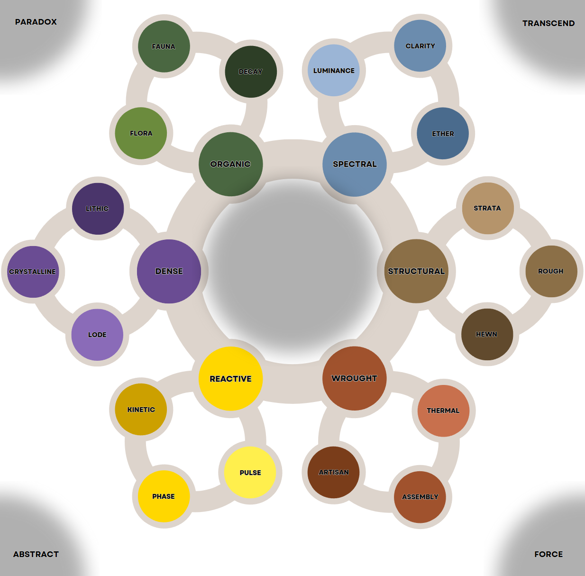
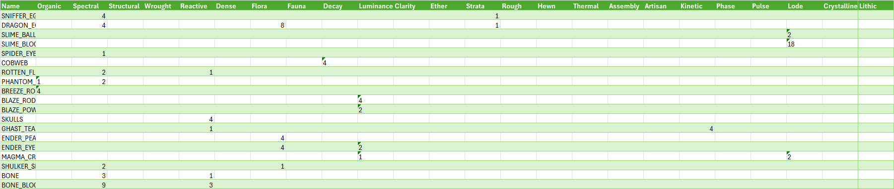
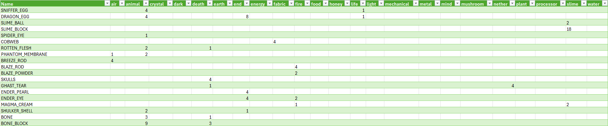
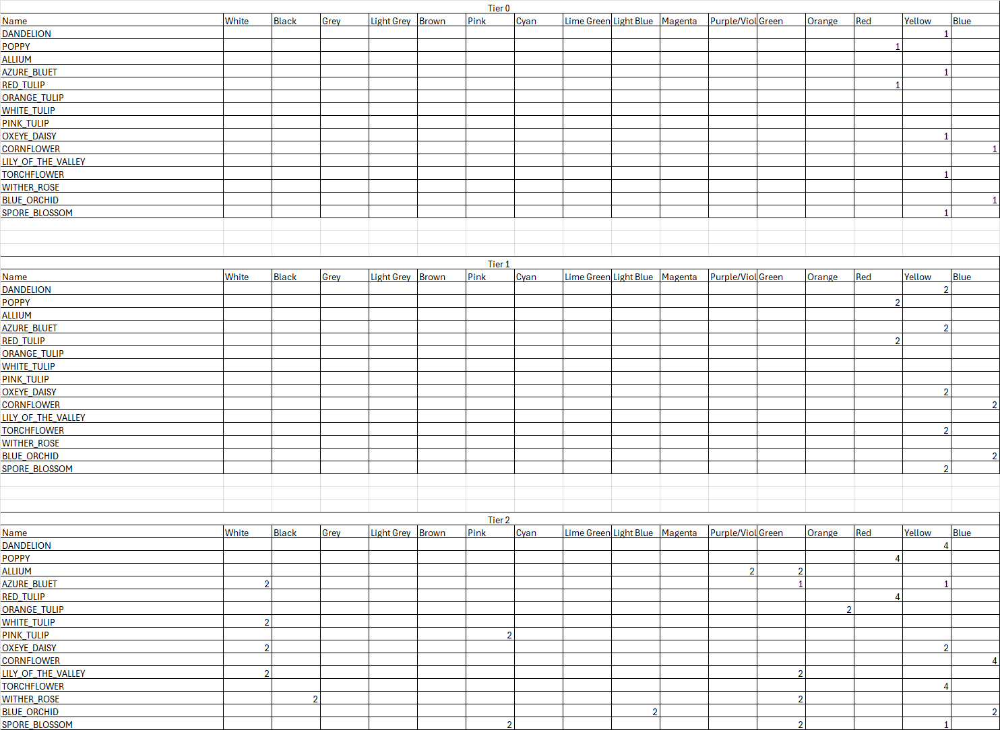
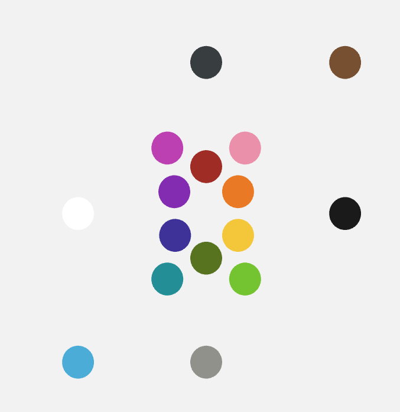
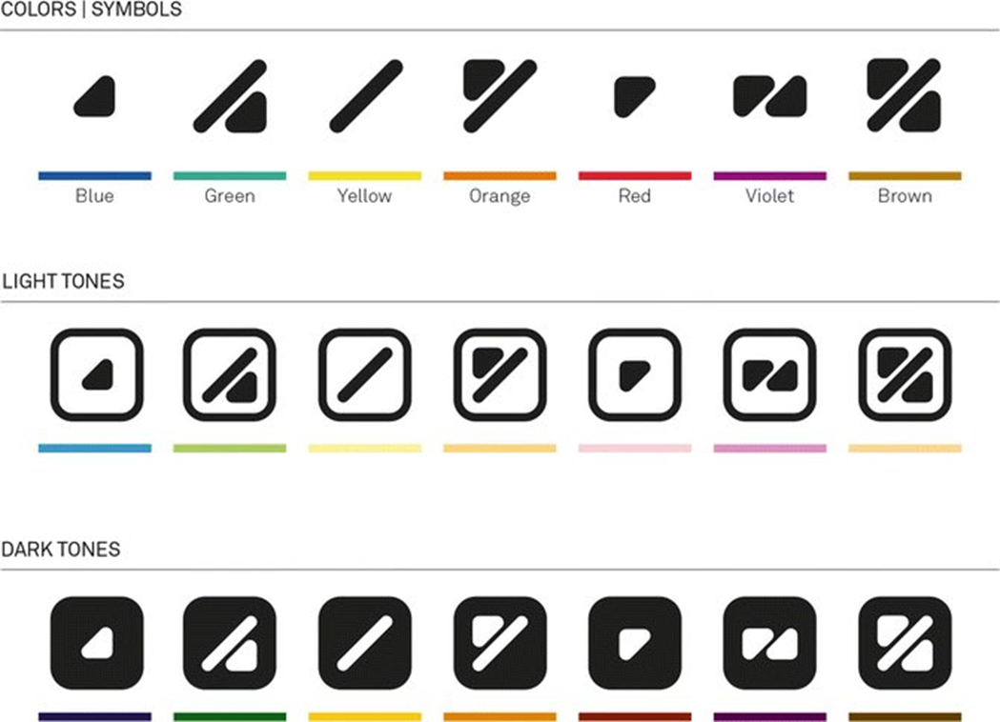

# Which essence system would you like the project to use?
## Question
Which essence system would you like the project to use?
## Discussion Thread
- [Poll link](https://discord.com/channels/1374772629298483202/1385832517000499354)
## Options
### Conceptual
> Sp3cialK's notes:

Structure
3 Tier : Essences > Components >< Unnatural
Theme
Textile / Function

I'd like to suggest the following
- Cords (6 types): Organic, Spectral, Structural, Wrought, Reactive, Dense
- Fibers (18 types): 3 per cord - Flora/Fauna/Decay, Luminance/Clarity/Ether, Strata/Rough/Hewn, Thermal/Assembly/Artisan, -Kinetic/Phase/Pulse, Lode/Crystalline/Lithic
- Strands (8 types): Synthetic combinations of fibers creating "unnatural" materials. Paradox(Temporal, Echo, Phantom, Mirror, Void), Transcend(Divine, Ethereal, Sacred, Sublime, Celestial), Force(Momentum, Entropy, Vector, Resonance, Nexus), Abstract(Dream, Whisper, Shadow, Mirage, Glimpse)

___Processing Methods:___
- Unraveling: Blocks/Items > Cords (basic breakdown)
- Fraying: Cords > Fibers (intermediate separation)
- Shredding: Blocks/Items > Fibers (direct processing)
- Spinning: Fibers > Strands (synthesis of unnatural material)

Items/Blocks can yield multiple cords (eg. sand > Structural, Reactive). This could be a percent chance or a fixed ratio yield.
Fraying allows obtaining any fiber type within a cord category, creating flexibility when specific materials are scarce.
While Shredding is more targeted and could provide a higher yield.

- ___Organic Cord:___ Living or once-living materials that grow, reproduce, or sustain life. Represents the biological cycle of existence.
(Wheat, beef, leather, bone, flowers, saplings, eggs, rotten flesh, mushrooms, leaves)
- ___Spectral Cord:___ Light, transparency, and otherworldly materials. Represents illumination, dimensional properties, and mystical energies.
(Torches, glowstone, glass, ender pearls, sea lanterns)
- ___Structural Cord:___ Building materials and foundational blocks in their natural or basic processed state. Represents the framework of construction.
(Stone, dirt, cobblestone, sand, gravel, bricks, terracotta, stone bricks, stairs, slabs)
- ___Wrought Cord:___ Processed materials requiring skill, heat, or complex crafting. Represents transformation through effort and knowledge.
(Iron ingots, cooked food, tools, weapons, armor, books, maps)
- ___Reactive Cord:___ Materials that change state, move, or cause reactions. Represents dynamic forces and energy in motion.
(Redstone, TNT, water, lava, pistons, gunpowder, ice, blaze powder)
- ___Dense Cord:___ Heavy, mineral-rich materials formed under pressure or over geological time. Represents concentrated matter and treasures.
(Diamond ore, iron ore, obsidian, ancient debris, diamonds, emeralds, amethyst, netherite blocks)

### MVP
> Notes from previous post:  Galatic_15 and Rshtg7776

The proposed chart: 
Any spell, ability, etc falls under the alignments/and or a combination of them 

___Alignment:___ the alignments themselves are based entirely the rift essence chart that the dev team came up with (huge shout out to them). This feels like it would fit better in the lore than any standard element system. 

___Lore:___ all essence comes from the void. Some believe it's a primordial sea of essence, others believe its a God. Essence itself is the threads that support reality, and the force that all reality patterns itself off of. Using magic, these threads can be drawn into reality for use in various tasks. The threads can be further combined with each other to form unique essences in the form of thick ropes of power known as yarn.

**Core** Entropy/Void

**Primary Ring (clockwise from the top)**
- Light
- Fire
- Chaos
- Air
- Darkness
- Earth
- Order
- Water

The external essences are combinations of those of the primary ring
- Outside (clockwise from the top)
- Life
- Nether
- Plant
- Space
- Power
- Animal
- End
- Death
- Crystal
- Metal
- Time
- Fabric

Some essence names and choices have evolved through out the process. The changes will be reflected in the pictures.

### Color
> Mattdoeseverything notes: ___Color Essence System___

#### Overview

**What is it?**

A simple color based essence system to allow for further complexity based on available colors.

**How do players use it?**

Players will utilize different color essences in order to determine rift keys, access abilities, trade with guilds, amongst other ideas.

**Why is it important?**

This concept of color essences supports a simplistic easy-to-learn, difficult-to-master system that is endlessly expansive due to the combinations of colors.

#### Details
**How it would function?**

The color essence system would break down essences into basic colors (red, yellow, and blue) as primary, tier-one essences before unlocking dye filters in rifts to mix colors and create more color essences and unlock more complex rifts.

**How would players acquire it?**

Through the use of a deconstruction machine, players will strip items into their primary, tier-one essences.

After running enough rifts, the player may create/discover a primary color filter, also representing to one of the tier-one color essences. Passing primary, tier-one color essences through the primary color filter will mix the colors together and create a secondary, tier-two color essence.

This process will continue to secondary, tertiary, and quaternary tiers, or even more dependent on the required needs of the pack.

**What about accessibility? Like Colorblindness?**

Colors can be categorized into symbolism, so each color will be given an attributable symbol to distinguish them from each other. These symbols can even incorporate stitching patterns or other fabric manipulation patterns that exist.

___Notable Features:___
- Simplicity
- Ability to add or remove
- Easy to understand
- Easily expandable

### Abstaining

## Results
The poll was ran from the 21/06/2025 until 24/06/2025 with the following results:
1. Conceptual - 44%
2. MVP - 44%
3. Color - 9%
4. Abstaining - 2%
